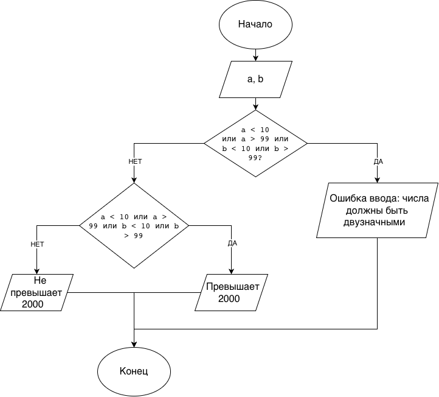

# Домашнее задание к работе 6

## Условие задачи
Проверить, превышает ли 2000 произведение двух натуральных двузначных чисел, введенных пользователем. Если введенные числа не двузначные, вывести сообщение об ошибке ввода.

## 1. Алгоритм и блок-схема

### Алгоритм
1. **Начало**
2. Задать исходные данные (ввод с клавиатуры):
   - `a` — первое натуральное число.
   - `b` — второе натуральное число.
3. Проверить условие корректности ввода (являются ли числа двузначными):
   - Если `a < 10` ИЛИ `a > 99` ИЛИ `b < 10` ИЛИ `b > 99`, то вывести `"Ошибка ввода: числа должны быть двузначными"` и перейти к шагу 5.
4. Если числа корректны, проверить их произведение:
   - Если `a * b > 2000`, вывести `"Превышает 2000"`.
   - Иначе вывести `"Не превышает 2000"`.
5. **Конец**

### Блок-схема
 

## 2. Реализация программы

```c
#include <stdio.h>

int main() {
    int a, b;

    printf("Введите два двузначных числа: ");
    scanf("%d %d", &a, &b);

    if (a < 10 || a > 99 || b < 10 || b > 99) {
        printf("Ошибка ввода: числа должны быть двузначными\n");
    } else {
        if (a * b > 2000) {
            printf("Превышает 2000\n");
        } else {
            printf("Не превышает 2000\n");
        }
    }

    return 0;
}
```

## 3. Результаты работы программы

```text
Введите два двузначных числа: 50 45
Превышает 2000
```

```text
Введите два двузначных числа: 20 30
Не превышает 2000
```

```text
Введите два двузначных числа: 5 100
Ошибка ввода: числа должны быть двузначными
```

## 4. Информация о разработчике

Цимбалист Костя бИЦТ-261
